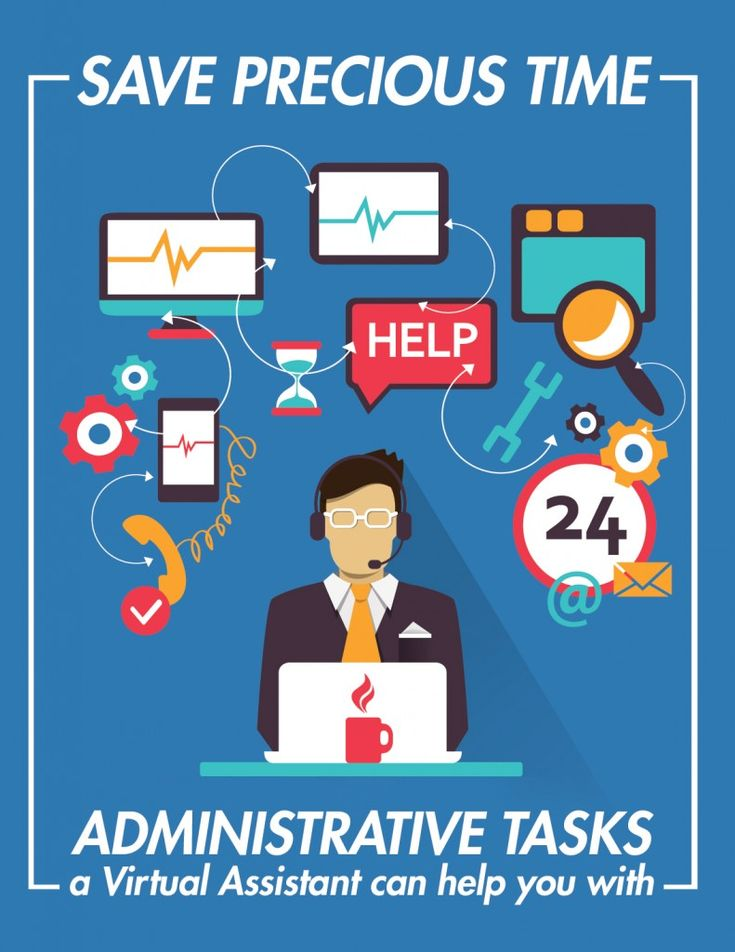

# Provoitus001 (Developing future)

> ## **_Observing , Understanding the problem , Learning , Developing , Imporving , Learning... (cycyle continues )_**

 

 
>

>  ### Your **_Personal  Desktop Assistent_** developed by **Pursottam Sah**

 

## Hello Everyone!
### Today i am glad to introduce my new project based on some bits of knowledge of Artificial Interlligence and Machine Learning  

> **Observed the problem** : _" Today's time most of the our daily work are on computer even jobs/classes. So it makes our brain litrally boared and less concentrated  and we found ourselves **out of track**_ " 

 

> **Solution** : So understanding the problem i came up with the  **_solution_** Introducing my virtual assistent app designed and developed by me.  
> Some our the features given below : 
> 1. **Daily Tasks** : As a _student_ we all know what kinds of tasks the **student** have to perform 
>    * Opening the **google chrome** (browser) via voice controll and Open Moodle Online Learning Platform 
>    * **Weather report**  and tomorrow forecast
>    * Listening **latest news headlines**. 
>    * **Motivation / inspirational Quotes**.  
>    * Opening **whatsapp** and send messages to friends via _voice controll_ (assistent)
>    * Opening a **book pdf and reading the lines** by assistent 
>    
>    * Ask anything : some **defination** it will tell you the summerise defination from **wekipedia** 
>    * Joining the **Google meet class link** by turning off the  camera and mute microphone 
> 2. **Calling Someone** : As calling from desktop is not so much easy but this assistant can    
>    * Call your **Teachers** just on single voice command
> 
>    * Call your **friends/relatives** from desktop and have fun without distrubing your **phone** from charging. 
 

>
 

> 3. **Opening Desktop apps** : Windows provides lots of apps but we usally uses 8-9 apps. **Examples**
>   * _VS Code_ : Most used application as a developer 
>   * _App Studios_: For learning app development 
>   * _Browser_: As a good developer i even ask silly questions from google but never stop learning... 
>   * Whatsapp : Important for official college notification 
>
>   * Ms word : for assisnment purspose only 
>   * **_Anything_** : **You just have to tell the name of app like to open and it will open the app for you** 
> 
> 4. **Relaxing** : _" No doubt this app is so interactive with you, like it's your friend."_
> * Open Youtube : **Play Music for relaxation**
> * **Play Bhajans** : "Play your favourite bhajans"
> * **Asking Time** : You may ask about time and date
> * **Social Media accounts**
    >   * **Github** : for checking and contribution in open source 
    >   * **Linkdin** : for cheking job / internhip offers 
    >   * **Instagram** : for cheking friends /gf messages 
    >   * **Facebook** : for fun purposes 
    >   * **Stackoverflow** : for latest information and question answering 

> ## _**Copywrite policy valid upto 2080 (Dont try to copy code)**_